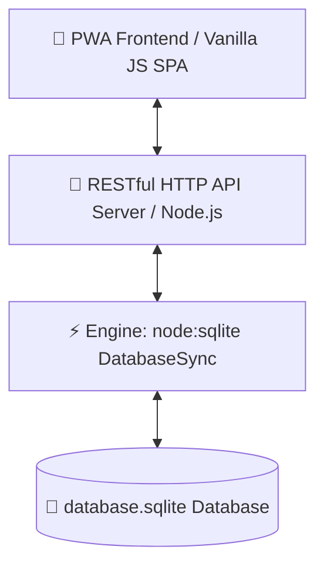

# 💚 منصة محفظة (Mahfaza) - نظام إدارة المصروفات العائلية والحسابات المالية

> **منصة متكاملة وحديثة لإدارة المالية الشخصية والعائلية بذكاء، مع دعم الحوكمة الأسرية، الإشعارات الفورية، الفواتير الدورية، المستشار المالي الذكي، وتطبيق الموبايل PWA.**

---

## 📖 جدول المحتويات (Table of Contents)
- [📌 مقدمة ورؤية المشروع](#-مقدمة-ورؤية-المشروع)
- [💡 المميزات والخصائص الرئيسية](#-المميزات-والخصائص-الرئيسية)
- [🏗️ المعمارية التقنية (Tech Stack)](#-المعمارية-التقنية-tech-stack)
- [🗄️ هيكل قاعدة البيانات (Database Schema)](#-هيكل-قاعدة-البيانات-database-schema)
- [🔌 دليل مسارات الـ API (API Reference)](#-دليل-مسارات-الـ-api-api-reference)
- [👥 حسابات تجريبية كبرى للبدء السريع](#-حسابات-تجريبية-برى-للبدء-السريع)
- [💻 دليل التشغيل المحلي (Local Setup)](#-دليل-التشغيل-المحلي-local-setup)
- [🌐 دليل النشر والرفع المباشر (Production Deployment)](#-دليل-النشر-والرفع-المباشر-production-deployment)

---

## 📌 مقدمة ورؤية المشروع

تم تطوير منصة **"محفظة"** لتلبية الحاجة إلى نظام مالي عربي متطور يجمع بين سهولة الاستخدام الشخصي وحوكمة المصروفات العائلية. يتيح النظام لرب الأسرة أو مدير المالية تحديد الميزانيات، التحكم في صلاحيات الأعضاء، استلام ومراجعة طلبات التمويل والمصروفات، وتلقي تنبيهات وإشعارات فورية مع تحليلات ذكية لترشيد الإنفاق.

---

## 💡 المميزات والخصائص الرئيسية

### 1️⃣ 👨‍👩‍👧‍👦 الحوكمة الأسرية والمساحات المشتركة (Family Governance)
- **موافقات طلب الانضمام**: عدم إظهار أي بيانات مالية للمستخدم الجديد حتى يوافق مالك المساحة صراحةً.
- **كود انضمام آمن**: حظر تعديل كود المساحة إلا لمالك المساحة الأصلي.
- **إدارة صلاحيات الأعضاء والميزانيات**: تحديد حد أقصى للإنفاق الشهري لكل فرد بالأسرة مع شريط تقدم تنبيهي ذكي (🟢 آمن، 🟡 تنبيه، 🔴 تجاوز).
- **إزالة الأعضاء حواكمية**: حظر وحذف الأعضاء فقط من قبل مالك المساحة.

### 2️⃣ 💸 نظام طلبات التمويل والمصروفات (Fund Requests System)
- إمكانية تقديم طلب تمويل أو شراء لأفراد الأسرة مع تحديد السبب والمبلغ والفئة.
- إشعار مالك الأسرة فوراً بالموافقة أو الرفض.
- تحويل الطلب المعتمد آلياً لمعاملة مصروفات خصماً من حساب الأسرة المعتمد.

### 3️⃣ 🔔 مركز الإشعارات الفورية (Real-Time Notification Center)
- أيقونة جرس `🔔` في أعلى الشريط العلوي مع عداد حمراء حية ترصد الإشعارات غير المقروءة.
- تنبيهات فورية لطلبات الانضمام، موافقات التمويل، تذكير الفواتير، وتحذيرات الميزانيات.

### 4️⃣ 📅 جدولة وتذكير الفواتير الدورية (Recurring Bills)
- جدولة الفواتير والالتزامات الشهري (كهرباء، إنترنت، إيجار) وتحديد يوم استحقاقها.
- خيار خصم الفاتورة عند السداد من حساب مالي مخصص (بنك، خزينة نقدية، كارت).
- زر **`⚡ دفع الآن`** لنقل الفاتورة آلياً لمصروفات الشهر وتحديث الرصيد.

### 5️⃣ 📱 تطبيق الموبايل والعمل بدون إنترنت (PWA & Offline App)
- يدعم معايير **Progressive Web App (PWA)** عبر `manifest.json` و `sw.js`.
- زر **`📲 تثبيت التطبيق`** لتنزيل المنصة كـ تطبيق أندرويد/آيفون مستقل على الهاتف.
- دعم العمل والتصفح بدون إنترنت (Offline Sync).

### 6️⃣ 🤖 المستشار المالي الذكي (AI Financial Advisor & Insights)
- تحليل ذكي لنمط استهلاك الأسرة وتوليد نصائح وإرشادات باللغة العربية.
- **الاقتراح التلقائي الذكي للفئات**: عند كتابة بيان المعاملة (مثل: "أوبر"، "كارفور"، "فاتورة نت") يتم اختيار الفئة المناسبة تلقائياً.

### 7️⃣ 📊 التصدير والتقارير المتقدمة (Excel & PDF Reports)
- **تصدير Excel (.csv)**: تحميل المعاملات بملف Excel مبوب بترميز `UTF-8 BOM` يدعم اللغة العربية دون رموز غريبة.
- **طباعة تقرير PDF الراقية**: طباعة وتصدير تقرير مالي ملخص للمساحة.

### 8️⃣ 🌍 تعدد العملات وسجل الأنشطة والتدقيق (Multi-Currency & Audit Log)
- **تعدد العملات**: دعم (ج.م EGP، ﷼ SAR، د.إ AED، $ USD، € EUR) وتحديث الرمز ديناميكياً.
- **سجل التدقيق (Audit Log)**: شاشة `📜 سجل الأنشطة` لمراقبة تفاصيل جميع العمليات والتسجيلات زمنيًا مع اسم الفاعل.

### 9️⃣ 🛡️ لوحة السوبر أدمن والنسخ الاحتياطي (Super Admin & Backup)
- إدارة كاملة للمستخدمين والمساحات بالنظام.
- تنزيل نسخة احتياطية حية من قاعدة البيانات `database.sqlite` بنقرة واحدة.

---

## 🏗️ المعمارية التقنية (Tech Stack)



- **Backend**: Node.js v18+ (استخدام Standard Libraries الحافة `node:http`, `node:sqlite`, `crypto`, `fs`, `path`).
- **Database**: SQLite3 المحلي الحقيقي عبر `DatabaseSync`.
- **Frontend**: Vanilla JavaScript (SPA), Vanilla CSS (Tokens, Glassmorphic UI), Progressive Web App (PWA Service Worker).
- **Authentication**: JWT Base64 Token Signatures + Crypto Scrypt Password Hashing.

---

## 🗄️ هيكل قاعدة البيانات (Database Schema)

| اسم الجدول | الوصف والوظيفة |
| :--- | :--- |
| `users` | حسابات المستخدمين بالنظام (البريد، كلمة المرور المفرومة، اسم المستخدم، الرتبة العامة). |
| `workspaces` | المساحات المالية (الشخصية والعائلية) مع رمز العملة وتحديد المالك وكود الدعوة. |
| `workspace_members` | العضوية والصلاحيات والحد الأقصى للإنفاق الشهري وحالة الانضمام (pending / approved). |
| `invites` | طلبات الانضمام والاستدعاءات للمساحة. |
| `accounts` | الحسابات المالية (البنك، الخزينة، فودافون كاش، بطاقات الائتمان) ورصيدها. |
| `categories` | الفئات والمجموعات المالية (دخل ومصروفات) مع الأيقونات والألوان. |
| `transactions` | المعاملات المالية المعتمدة (مبلغ، تاريخ، نوع، ملاحظة، الحساب، الفئة). |
| `budgets` | الميزانيات الشهرية المخصصة للفئات. |
| `fund_requests` | طلبات التمويل والمصروفات المقترحة من الأعضاء لرب الأسرة. |
| `notifications` | مركز الإشعارات والتنبيهات الفورية لكل مستخدم. |
| `recurring_bills` | الفواتير والالتزامات الدورية الجاهزة للسداد. |
| `audit_log` | سجل الأنشطة والتدقيق الزمني الشامل للأمان والشفافية. |

---

## 🔌 دليل مسارات الـ API (API Reference)

### 🔐 المصادقة والحسابات (Auth APIs)
- `POST /api/auth/signup`: تسجيل حساب جديد.
- `POST /api/auth/login`: تسجيل الدخول بالبريد أو `@username`.
- `POST /api/auth/join-by-code`: الانضمام السريع بمساحة عائلية بكود الدعوة.
- `GET /api/auth/me`: جلب بيانات المستخدم الحالي ومساحاته.
- `PUT /api/auth/profile`: تحديث البيانات الشخصية والبروفايل.

### 👨‍👩‍👧‍👦 المساحات والأعضاء (Workspaces & Members)
- `GET /api/workspaces`: جلب جميع مساحات المستخدم.
- `POST /api/workspaces`: إنشاء مساحة جديدة.
- `PUT /api/workspaces/:id/currency`: تحديث عملة المساحة (EGP, SAR, AED, USD, EUR).
- `GET /api/workspaces/:id/members`: جلب أعضاء المساحة وطلبات الانضمام المعلقة ومعدل الاستهلاك.
- `PUT /api/workspaces/:id/members/:memberId`: تحديث رتبة وميزانية العضو الشهري.
- `DELETE /api/workspaces/:id/members/:memberId`: إزالة عضو من المساحة العائلية.

### 💸 طلبات التمويل والمعاملات (Fund Requests & Transactions)
- `GET /api/fund-requests?workspace_id=...`: جلب طلبات التمويل بالأسرة.
- `POST /api/fund-requests`: تقديم طلب تمويل جديد لرب الأسرة.
- `PUT /api/fund-requests/:id`: موافقة أو رفض طلب التمويل (تحويل آلي لمصروف).
- `GET /api/transactions?workspace_id=...`: جلب المعاملات مع التصفية والبحث.
- `POST /api/transactions`: إضافة معاملة دخل أو مصروف جديدة.

### 🔔 الإشعارات والفواتير الدورية (Notifications & Bills)
- `GET /api/notifications`: جلب الإشعارات الفورية غير المقروءة والكلية.
- `PUT /api/notifications/read-all`: تحديد كافة الإشعارات كمقروءة.
- `GET /api/recurring-bills?workspace_id=...`: جلب الفواتير المجدولة.
- `POST /api/recurring-bills`: إضافة فاتورة دورية جديدة.
- `POST /api/recurring-bills/:id/pay`: سداد الفاتورة الدورية وتمريرها لمصروفات الشهر خصماً من الحساب المحدد.

### 📊 التصدير والتدقيق (Export & Audit)
- `GET /api/export/excel?workspace_id=...`: تنزيل ملف Excel (.csv) مترجم بـ UTF-8 BOM.
- `GET /api/audit-log`: جلب سجل الأنشطة والتدقيق.

---

## 👥 حسابات تجريبية كبرى للبدء السريع

| المستخدم | اسم المستخدم / البريد | كلمة السر | الدور والوصف |
| :--- | :--- | :--- | :--- |
| **السوبر أدمن** | `admin` أو `admin@mahfaza.app` | `123456` | إدارة النظام الكاملة والنسخ الاحتياطي. |
| **أحمد محمود** | `ahmed` أو `ahmed@mahfaza.app` | `123456` | **مالك أسرة أحمد محمود العائلية** (مالك المساحة). |
| **سارة أحمد** | `sara` أو `sara@mahfaza.app` | `123456` | **عضو ومشرف الأسرة** (Admin). |
| **يوسف أحمد** | `youssef` أو `youssef@mahfaza.app` | `123456` | **عضو بالأسرة** (Member). |

*كود الانضمام المباشر لأسرة أحمد*: **`FAM-AHMED`**

---

## 💻 دليل التشغيل المحلي (Local Setup)

### 1. المتطلبات:
- تثبيت **Node.js** (إصدار v18 أو v20+).

### 2. التثبيت والتشغيل:
```bash
# 1. الاستنساخ أو الانتقال لمجلد المشروع
cd "مشروع نظام إدارة المصروفات العائلية"

# 2. تشغيل سيرفر المنصة مباشرة (Port 4000)
node server.js
```

افتح المتصفح على:  
👉 **[http://localhost:4000](http://localhost:4000)**

---

## 🌐 دليل النشر والرفع المباشر (Production Deployment)

المنصة مجهزة بالكامل للنشر الفوري والمجاني على منصة **Render.com**:

1. اركب مشروعك على مستودع **GitHub**.
2. افح حساب في **Render.com** واختر **New Web Service**.
3. ضع أمر البداية **`Start Command`**: `node server.js`.
4. ستحصل على موقع مالي حي على الإنترنت يخدم الأسرة مجاناً مع دعم التحديث التلقائي! 🚀
